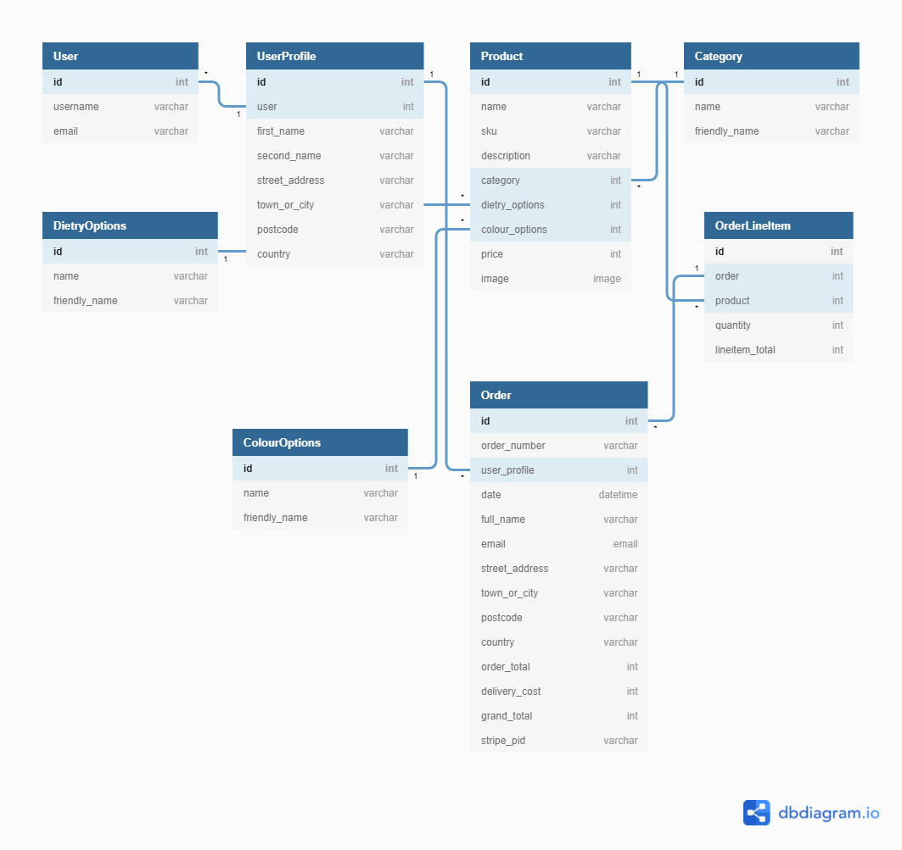

# Cake Shop

### Milestone Four

Over the last year or so, Jane has changed a hobby into a growing business. In order to stay competitive and viable, new markets need to be opened, the largest market she can tap into is online shopping. Therefore the next logical step is an e-commerce site. As well as providing sales a full-stack site can give her a greater understanding of her client base and the products that they buy.

## Demo

[View the live website here](https://cm-cake-shop-ms4.herokuapp.com/)

<!--  -->

## User Experience (UX)

The aim is to build a user-friendly e-commerce store. It will be based around browsing, selecting and buying products.

Users should be able to view products in a collection or as an individual product. They should be able to search the product base for a particular product or keyword. Items should be easily added and removed from the shopping basket. Users should be able to checkout with ease. Users with a account should be able to see their pervious orders, order status and edit any personal information.

An Admin users should be able to add, edit and remove both products and images conveniently from the frontend. They should be able to edit and update orders status and information.

### User stories
#### Shopper Story 1
-   As a Shopper, I want to browse products and add them to my basket.
#### Acceptance Criteria
-   Show a summary of all products on a page.
-   Be able to filter by
    -   product type
    -   colour
    -   season
    -   dietary restriction
-   Be able to search the product list for key words.
-   Show the detail of an individual product.
-   Mechanism to add multiples of a product to the basket.
-   Confirmation that the product has been added to the basket.
#### Shopper Story 2
-   As a Shopper, I want to be able to view/edit my basket.
#### Acceptance Criteria
-   Show a summary of the basket items.
-   Items have the ability to change quantity.
-   Items can be deleted from the basket.
#### Shopper Story 3
-   As a Shopper, I would like to pay for my items.
#### Acceptance Criteria
-   Inputs are clear and rational.
-   Payments are confirmed on the site and via email.
-   Payment should be taken from the account.
#### Shopper Story 4
-   As a Shopper, I would like to navigate the site easily on any device.
#### Acceptance Criteria
-   Clear menu options.
-   Responsive on all devices.
#### Shopper Story 5
-   As a returning user, I would like to see my previous orders and edit my information.
#### Acceptance Criteria
-   There is a working Register page.
-   The user can log in/out.
-   The account page has a list of orders.
-   The account contains;
    -   Billing address
    -   Name
    -   Dietary requirement
#### Shopper Story 6
-   As a returning user, I would like to re-set my password.
#### Acceptance Criteria
-   A forgotten my password link on the login page.
-   A forgotten my password form, that works.
-   The user can change the password on the account page.
#### Shopper Story 7
-   As a user, I would like contact the store owner.
#### Acceptance Criteria
-   A Contact Us page exists.
-   It contacts the store owner.
#### Shop Owner Story 1
-   As a Shop Owner, I would like to manage products.
#### Acceptance Criteria
-   There is an add product page
-   There is an edit products page
-   There is a delete products button
-   Deleting a product is easy
-   There should be mechanisms in place to prevent accidental deletion
#### Shop Owner Story 2
-   As a Shop Owner, I would like to manage orders.
#### Acceptance Criteria
-   There is a way to view all orders
-   Orders can be viewed in detail
-   Status of the order can be changed
#### Shop Owner Story 3
-   As a Shop Owner, I would like to manage the information my customers see.
#### Acceptance Criteria
-   The Owner can add, edit and delete
    -   Frequently Asked Questions
    -   Gallery images
    -   Categories
#### Shop Owner Story 4
-   As a Shop Owner, I would like my site to be secure.
#### Acceptance Criteria
-   Secure pages require a password to access.
### Skeleton (wireframes)

**Home page**
<br/>
Welcomes user to the site. Large image with a call to action button. Fixed navigation bar at the top of the page, which will be carried on to the rest of the site, with the logo, name, search bar and menu items.
<br/>
[Mobile](readme-docs/wireframes/phone/Mobile-Home.png)
<br/>

**All products page**
<br/>
The products will be shown in their own cards. Each card will contain an image, price and short description. search and filter products each product should link to its own product.
<br/>
[Mobile](readme-docs/wireframes/phone/Mobile-All_Products)
</br>

**Product page**
<br/>
This page will be a blown up version of the product card on the 'all products' page. The card will contain an image or two of the product, the price, a short description, colour selection dropdown (if applicable), diary requirements dropdown (if applicable), a quantity selector and a buy button.
<br/>
[Mobile](readme-docs/wireframes/phone/Mobile-Product.png)
<br/>

**Shopping Basket page**
<br/>
This will be a list of the products in the basket, each item in the basket will show a small image, product title, colour, dietary requirement, quantity and price. Items will be able to be edited or removed from the shopping basket. Subtotals will be shown at the end of each row with the Total for the order being shown at the bottom of the table. Checkout button will only be accessible when minimum order quality has been met.
<br/>
[Mobile](readme-docs/wireframes/phone/Mobile-Basket.png)
<br/>

**Checkout page**
<br/>
This will contain all the necessary information to check out in a simple form. This form will contain; name, email address, delivery address, billing address (if different) and delivery date. There will also be a comments box that can be used to give any special requests/allergy's or dietary requirement. If the user is logged in fields will be pre-filled with name and delivery address. A brief summary of the charge to made on the account. Stripe will be used for the payment/card details section.
<br/>
[Mobile](readme-docs/wireframes/phone/Mobile-Checkout.png)
<br/>

**We will process your order page**
<br/>
This page confirms that the order has been received. It will confirm the delivery date and that a payment of £xx.xx has been taken, as well as wether any special requests/dietary requirements have been made. It will encourage users who don't have an account, to register for an account so they can track there order.
<br/>
[Mobile](readme-docs/wireframes/phone/Mobile-Order_Success.png)
<br/>

**Register page**
<br/>
This page will allow the user to register for an account using a simple form. This form will contain; name, email address, billing address, password field, dietary requirements, comments box for allergies and confirm password field. If the user has come from the checkout page the form will be pre-filled with the details from the checkout form. This page is also contain a link to the log in page
<br/>
[Mobile](readme-docs/wireframes/phone/Mobile-Register.png)
<br/>

**Login page**
<br/>
This page is a simple log in page, It will have a link to the register page and will prompt users if they don't use a registered email address.
<br/>
[Mobile](readme-docs/wireframes/phone/Mobile-LogIn.png)
<br/>

**Account page**
<br/>
The user will be able to update their account information and see a summary of their previous orders. The account information will be able to be updated. When a order is selected the user will be able to see more details about the order. The User will be able to log in and out.
<br/>
[Mobile](readme-docs/wireframes/phone/Mobile-Account.png)
<br/>

**Gallery page**
<br/>
This page is an opportunity for the shop owner to showcase their work. It shows pictures of previous orders in a instagram style gallery.  Admin users will be able to add, change and delete the photos in the Gallery.
<br/>
[Mobile](readme-docs/wireframes/phone/Mobile-Gallery.png)
<br/>

**Admin page**
<br/>
This will only be accessible by an admin user, it will allow the user to navigate different areas of the site to manage the details there. It will also show a summary of all the orders, with the ability to search them and filter them.
<br/>
[Mobile](readme-docs/wireframes/phone/Mobile-Admin.png)
<br/>

**Contact page**
<br/>
This will be a simple contact form to allow users to contact the shop owner.
<br/>
[Mobile](readme-docs/wireframes/phone/Mobile-Contact_Us.png)
<br/>

**Notifications**
<br/>
Notifications will be triggered when:
-   Item is added or removed from the basket
-   Item Quantity is changed in the basket
-   A Product, Image, Category or FAQ is added, edited or deleted
<br/>
Notifications will be displayed in a Message Bar across the top of the site.
<br/>

## Design Considerations and General Comments
### Buy button location
The 'checkout' button is at the top of the screen with a summary of how much it will cost to encourage users to checkout early, eventually this will 'stick' to the top of the page so it is always accessible to the user.
### Webhooks
I have left webhooks until Issue two as I can see the power of them but feel that I need to do some more research before implementing them.
### Refactoring
I have done limited re-factoring on this project, I would have liked to split the css file into multiple files however have been focusing more on adding functionality.
### Wireframes
I have fully embraced the mobile first philosophy, this means I have detailed mobile wireframes but no tablet or desktop wireframes.  It was a continuous decision to do mobile wireframes in great detail, as more users are on mobile devices and i wanted the Shop Owners to be able to do things when they had a moment rather than having to set time aside when they are on a computer.
### Secret Key in Github Repo
This was done in error, the Secret key is question was changed and moved to the env.py before full deployment.
### Error Pages and Security
I had hoped to include custom error pages for 404, 500 and 403 errors. Alas time got away with me (as it often does). I planned to have the header and footer displayed on the error page allowing the user to easily navigate to where they need to be.  until i have created theses pages however I have ensured that most Errors display to the user in the message bar. I believe I have covered most of the big security issues however would be very interested to know if you find any!
### Comments
There are a greater than average comments in this code, this is because it is still quite a work in progress, I would usually try to remove more of these comments however I have run out of time.
## Features
I have split the features into Beta, Issue 1, Issue 2 & Issue 3. The project is currently at the Issue one.
-   ### Beta
    -   Register
    -   Log on/off
    -   CRUD on products
    -   Add items and edit items in the Basket
    -   Checkout functionality.
-   ### Issue 1
    -   CRUD on Gallery
    -   user controlled CRUD on Categories
    -   CRUD on FAQs
    -   Confirm Delete item
    -   Collapsible functionality given to relevant cards
-   ### Issue 2
    -   Send real emails!
    -   set up webhooks for stripe
    -   Make Responsive on all Devices
    -   Search terms being added to the search term bar (under the search bar)
    -   'Harder' to delete items
    -   Shop owner to control free delivery ect
    -   User Profiles contain user information that can be updated
-   ### Issue 3
    -   Shop owner to be able to update the status of an order
    -   Shop Owner can search and filter orders
    -   Send email when someone has left things in there basket
    -   A user/customer blog
        -   option to post to social media sites
    -   User can delete their profile
## Database

## Technologies Used
### Languages Used
-   [HTML5](https://en.wikipedia.org/wiki/HTML5)
-   [CSS3](https://en.wikipedia.org/wiki/Cascading_Style_Sheets)
-   [JS](https://en.wikipedia.org/wiki/JavaScript)
-   [Django](https://docs.djangoproject.com/en/4.0/)
### Frameworks, Libraries & Programs Used
-   [Google Fonts](https://fonts.google.com/)
-   [Heroku](https://id.heroku.com/)
-   [Cypress](https://docs.cypress.io/guides/overview/why-cypress)
### Resources
-   [Code Institute Course Content](https://courses.codeinstitute.net/)
-   Code Institute **SLACK Community**
-   [Stack Overflow](https://stackoverflow.com/)
-   [YouTube](https://www.youtube.com/)
-   [CSS-Tricks](https://css-tricks.com/)
-   [Balsamiq](https://balsamiq.com/wireframes/)
-   [techsini](https://techsini.com/multi-mockup/)
-   [dbdiagram](https://dbdiagram.io/)
# Testing
## User stories
#### Shopper Story 1 -PASS
-   As a Shopper, I want to browse products and add them to my basket.
#### Acceptance Criteria
-   Show a summary of all products on a page. - PASS
-   Be able to filter by
    -   product type - PASS
    -   colour - Not Applicable to Issue 1
    -   season - Not Applicable to Issue 1
    -   dietary restriction - Not Applicable to Issue 1
-   Be able to search the product list for key words. - PASS
-   Show the detail of an individual product. - PASS
-   Mechanism to add multiples of a product to the basket. - PASS
-   Confirmation that the product has been added to the basket. - PASS
#### Shopper Story 2 - PASS
-   As a Shopper, I want to be able to view/edit my basket. - PASS
#### Acceptance Criteria
-   Show a summary of the basket items. - PASS
-   Items have the ability to change quantity. - PASS
-   Items can be deleted from the basket. - PASS
#### Shopper Story 3
-   As a Shopper, I would like to pay for my items.
#### Acceptance Criteria - FAIL
-   Inputs are clear and rational. - PASS
-   Payments are confirmed on the site and via email. -FAIL - Emails not working
-   Payment should be taken from the account. - PASS
#### Shopper Story 4 - PASS
-   As a Shopper, I would like to navigate the site easily on any device.
#### Acceptance Criteria
-   Clear menu options. - PASS
-   Responsive on all devices. - PASS
#### Shopper Story 5 - PASS
-   As a returning user, I would like to see my previous orders and edit my information.
#### Acceptance Criteria
-   There is a working Register page. - PASS
-   The user can log in/out. - PASS
-   The account page has a list of orders. - PASS
-   The account contains;
    -   Billing address - PASS
    -   Name - PASS
    -   Dietary requirement - Not Applicable to Issue 1
#### Shopper Story 6 - FAIL
-   As a returning user, I would like to re-set my password.
#### Acceptance Criteria
-   A forgotten my password link on the login page. - FAIL - Emails not working
-   A forgotten my password form, that works. - FAIL - Emails not working
-   The user can change the password on the account page. - Not Applicable to Issue 1
#### Shopper Story 7 - PASS
-   As a user, I would like contact the store owner.
#### Acceptance Criteria
-   A Contact Us page exists. - PASS
-   It contacts the store owner. - PASS
#### Shop Owner Story 1
-   As a Shop Owner, I would like to manage products.
#### Acceptance Criteria - PASS
-   There is an add product page - PASS
-   There is an edit products page - PASS
-   There is a delete products button - PASS
-   Deleting a product is easy - PASS
-   There should be mechanisms in place to prevent accidental deletion - PASS
#### Shop Owner Story 2 - PASS
-   As a Shop Owner, I would like to manage orders.
#### Acceptance Criteria
-   There is a way to view all orders - PASS
-   Orders can be viewed in detail - PASS
-   Status of the order can be changed - Not Applicable to Issue 1
#### Shop Owner Story 3 - PASS
-   As a Shop Owner, I would like to manage the information my customers see.
#### Acceptance Criteria
-   The Owner can add, edit and delete
    -   Frequently Asked Questions  - PASS
    -   Gallery images  - PASS
    -   Categories  - PASS
#### Shop Owner Story 4 - PASS
-   As a Shop Owner, I would like my site to be secure.
#### Acceptance Criteria
-   Secure pages require a password to access.  - PASS
## Validators
### HTML Validator
### CSS Validator

### PEP8
Passed - some comments about line being a little too long, changed where possible.
### Testing Summary
Site looks it best on Mobile, App is fairly well secured.  Removing the Contact Page as there is No time to fix before deployment, issue is due to trying to set up emails. One or two bugs picked up and fixed during texting see bug section for more information. Note - this code has not been through a validator.
### Interesting Bugs / Issues
This section will detail the interesting Issues and Bugs that I came across whilst coding and the main ones that I found during testing.

**During coding**

| Issue/Bug | Comments | Final Fix |
| --------- | -------- | --------- |
| image not fully deleting | When a product is deleted the image is left in the database, this could cause storage and coding issues in the future. Whilst this is not a 'bug' to ensure the expandability of the site I have excluded it here. | Installed django cleanup. deletes the image completely from the database. https://pypi.org/project/django-cleanup/0.1.9/ |
|You can checkout with less than 6 cakes|I found that by changing the link to checkout in the address bar I could checkout with less than 6 cakes, which is the minimum order quantity.| Added an if statement to the check view to enure that this can no longer be done|
| Real Emails not sending | I have tried two different companies to send real emails and looked at using an API to send emails. However I cannot seem to get it to work! For now I have turned off the Confirmation Email for the log on to allow users to use the site. Emails are logging fine to the console more investigation is required.| To be found - temporarily turned off email confirmation required.
| Date picker wasn't showing | This is a 'expected' error but was causing issues when submitting the form | https://stackoverflow.com/questions/60389224/datetimeinput-is-being-rendered-as-simple-text-input-in-django

**During Testing**

| Issue/Bug | Comments | Final Fix |
| --------- | -------- | --------- |
| Basket page not loading on server | I works on my local drive, seems to be an issue with the quantity-form includes. Routing is stringent on heroku the / is a \! |change the \ for a / |
| Checkout next buttons just reloading the page| I had not added the js to do this. js added and now works| added the code to make it work|
|Contact Page has catastrophic error with the table or model| Due to time constraints i don't have tie to fix this so i have removed the page, it is likely to do with the emails i tried to set up as i was setting them up in the contact section| remove link to the page temporarily|

## Deployment
### Project Creation
I used VScode and git to produce this project.
<br/>
The following commands were used to keep version control
-   `git add .` to stage files before committing
-   `git commit -m "message explaining commit"` to commit the local repository
-   `git push` to push all committed changes to the GitHub repository

### Deployment to Heroku

**Create application:**

1. Navigate to Heroku.com and login or sign up.
2. Click on the new button.
3. Select create new app.
4. Enter the app name, this must be unique.
5. Select region.
6. Click Create App.

**Set up connection to Github Repository:**

1. Click the deploy tab
2. Select GitHub as the deployment method.
3. A prompt to find a github repository to connect to will then be displayed.
4. Enter the repository name for the project and click search.
5. Once the repo has been found, click the connect button.
6. To enable automatic deployment (_optional_)
    1. Scroll to the Automatic deploys section
    2. Choose the branch you want to deploy from
    3. Click Enable Automation Deploys.

**Set environment variables:**

1. Click on the settings tab
2. Click the 'reveal config vars' button.
3. Variables needed:
    - SECRET_KEY
<br/>my Variables for this project
    - DATABASE_URL
    - STRIPE_PUBLIC_KEY
    - STRIPE_SECRET_KEY
    - AWS_ACCESS_KEY_ID (_CSV File_)
    - AWS_SECRET_ACCESS_KEY (_CSV File_)
    - USE_AWS = True

_These variables change depending on your set up so I will not add mine here._
### Hosting Static Files and Images
I used aws to host my static and media files

**Set up s3 bucket**

1. Navigate to aws.amazon.com and login or sign up.
2. Navigate to the console and S3 bucket
3. Create a bucket using the create bucket button
    -   Select a name for your bucket
    -   Select a region, pick the one closet to you.
    -   Un-tick "Block all public access" and acknowledge the warming
    -   scroll to the bottom and press create bucket
5. Turn on static hosting
    -   Select your bucket and navigate to properties
    -   Scroll to the bottom where you will find "static website hosting"
    -   Click to edi
    -   Enable it
    -   Add default values for the index (index.html) and error (error.html) documents
    -   Click 'save changes'
6. Set CORS configuration
    -   Navigate to permissions
    -   Scroll to the bottom edit the CORS
    -   Paste in the below and save
```
[
  {
      "AllowedHeaders": [
          "Authorization"
      ],
      "AllowedMethods": [
          "GET"
      ],
      "AllowedOrigins": [
          "*"
      ],
      "ExposeHeaders": []
  }
]
```
7. Create a policy for you bucket.
    -   Select to edit the Bucket Policy
    -   Click policy generator (_this will load in a new tab_)
        - Select the 'S3 bucket policy' type
        - Put a * in the principal input to select all
        - select the 'get object' action
        - Fill in the ARN and click 'add statement' (_you can find the ARN on the Edit Bucket Policy Tab_)
        - Click 'generate policy'
        - Copy Policy JSON
    - Paste the Policy JSON into the input on the Bucket Policy Tab
    - add /* to the end of the resource key to allow access to the whole bucket
    - Click 'Save Changes'

**Create a User and Group for your bucket**

1. Navigate to IAM
2. Create a Group
    - Click 'User Groups' then 'Create group'
    - Name your group
    - click 'create group'
3. Give the Group Access to the S3 bucket
    - Click 'Policy' then 'Create policy'
    - go to the JSON tab and 'import managed policy'
    - Search for 'S3' and select the 'S3 full access policy'
    - Import the policy
    - Get the bucket ARN from the Bucket Policy Page in S3
    - Change the "Resources" section to a list as below;
    ```
        "Resource": [
            "bucket::ARN",
            "bucket::ARN/*"
        ]
    ```
    - Click through to 'Review Policy'
    - Give it a name and a description
    - Click 'Create Policy'
    - Go to User Groups, click the group you created and select the permissions tab
    - Go to 'Add permissions' and select 'Attach policies'
    - Select the policy you just created
    - Click Attach Policy at the bottom of the page
4. Create a User
    - Navigate to the User page
    - Click add User
    - Create a User with 'Programmatic access'
    - Click Next
    - Select the group you created and click through to the end
    - Click 'Create User'
    - **Download and Save the CSV File**, you will not be able to get this again

** Attach the settings to heroku **
1. Click on the settings tab
2. Click the 'reveal config vars' button.
3. Variables needed:
    - AWS_ACCESS_KEY_ID (_CSV File_)
    - AWS_SECRET_ACCESS_KEY (_CSV File_)
    - USE_AWS = True

NOTE: for this to work on other repos (if you are not cloning this one) you will need install boto3 and django-storages.
<br/>
NOTE: Keep you AWS access keys secret as they can be used to charge you money

### Making a Local Clone

1. Log in to GitHub and locate the [GitHub Repository](https://github.com/CharlieMallon/milestoneTwo)
2. Under the repository name, click "Clone or download".
3. To clone the repository using HTTPS, under "Clone with HTTPS", copy the link.
4. Open Git Bash
5. Change the current working directory to the location where you want the cloned directory to be made.
6. Type `git clone`, and then paste the URL you copied in Step 3.

```
$ git clone https://github.com/YOUR-USERNAME/YOUR-REPOSITORY
```

7. Press Enter. Your local clone will be created.

```
$ git clone https://github.com/YOUR-USERNAME/YOUR-REPOSITORY
> Cloning into `CI-Clone`...
> remote: Counting objects: 10, done.
> remote: Compressing objects: 100% (8/8), done.
> remove: Total 10 (delta 1), reused 10 (delta 1)
> Unpacking objects: 100% (10/10), done.
```

8. Once this has been completed use the following command to install all the packages required.

```
$ pip install -r requirements.txt
```

Click [Here](https://help.github.com/en/github/creating-cloning-and-archiving-repositories/cloning-a-repository#cloning-a-repository-to-github-desktop) to retrieve pictures for some of the buttons and more detailed explanations of the above process.

## Credits

### Code

| Source | Comments |
| ------ | -------- |
| [W3Schools](https://www.w3schools.com/howto/tryit.asp?filename=tryhow_css_modal)  and [My Milestone Two Project](cm-ms3-to-did.herokuapp.com/)| For the Modal html, CSS, and JS         |
| [W3Schools](https://www.w3schools.com/howto/tryit.asp?filename=tryhow_js_collapsible_animate) | For the basic animated collapsible cards |
| [W3Schools](https://www.w3schools.com/howto/howto_js_sidenav.asp) | For the side Nav |
| The Code Institute Boutique Ado mini-project | the whole project is based on it, where I haven't changed it at all I have put a comment to say its from the project |


### Content
-   I was inspired by the beautiful cakes made by [Cantelo Treats](https://www.facebook.com/cantelotreats)
-   All content was written by the developer.
-   Readme inspiration taken from [mitchdavenport88](https://github.com/mitchdavenport88/hop_shop/blob/main/README.md)

### Media

-   I used Stock photos from Pexels a [Cute Animal Collection](https://www.pexels.com/collections/cute-animals-17ey6em/) before adding the 'cake' images
-   All Images are copyright [Cantelo Treats](https://www.facebook.com/cantelotreats)
-   The social media icons svg's were supplied by [simple icons](https://simpleicons.org/ )


### Acknowledgements

-   My Mentor Brian Macharia for some good guidance.
-   Bim for the constant reminders that I can do this and nudges in the right direction.
-   Daisy for the troubleshooting sessions when I really got stuck.
-   The Code Institute community for all the moral and technical support.
